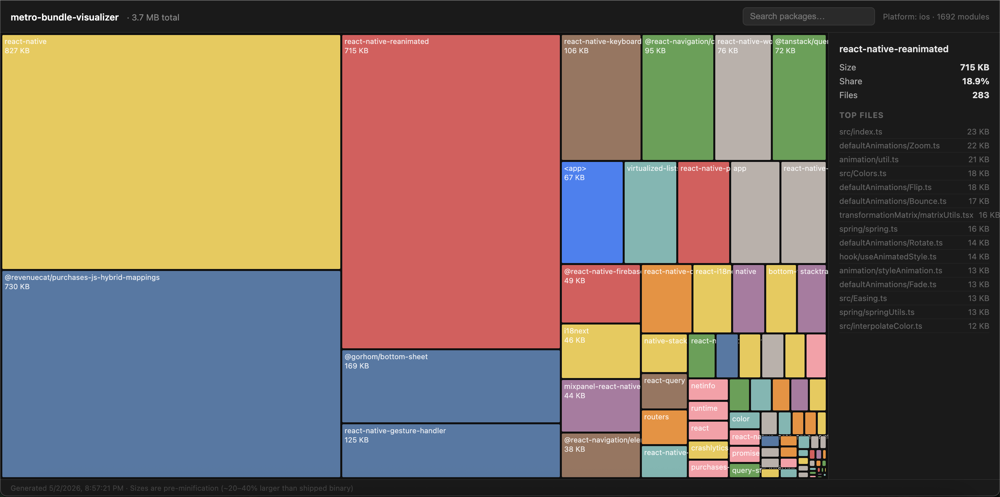

# metro-bundle-visualizer

[](https://www.npmjs.com/package/metro-bundle-visualizer)
[](https://www.npmjs.com/package/metro-bundle-visualizer)
[](https://github.com/suleymancelikel/metro-bundle-visualizer/actions/workflows/ci.yml)
[](LICENSE)

Interactive bundle size visualizer for React Native — works with RN 0.73+, New Architecture, zero config.



## Quick Start

```bash
npx metro-bundle-visualizer
```

Run from your React Native project root. An interactive HTML treemap opens in your browser.

## Installation

```bash
# one-off (recommended)
npx metro-bundle-visualizer

# or install globally
npm install -g metro-bundle-visualizer
```

Package on npm: [npmjs.com/package/metro-bundle-visualizer](https://www.npmjs.com/package/metro-bundle-visualizer)

## Usage

```
metro-bundle-visualizer [options]

Options:
  -p, --platform <ios|android>   Platform to bundle for (default: "ios")
  --dev                          Bundle in dev mode (default: false → production)
  --entry <path>                 Entry file (default: auto-detected from package.json "main")
  -o, --out <path>               Output HTML path (default: "./bundle-report.html")
  --no-open                      Don't open browser automatically
  --reset-cache                  Reset Metro cache before bundling
  --project-root <path>          Override cwd as the project root
  --json [path]                  Write bundle stats JSON (default: ./bundle-stats.json)
  --quiet                        Suppress progress output (errors always shown)
  --verbose                      Show full Metro output (deprecation/validation warnings)
  --budget <size>                Warn if bundle exceeds threshold (e.g. 3mb, 500kb, 1048576)
  --compare <path>               Show size deltas against a previous report
  -V, --version                  Print version
  -h, --help                     Show help
```

### Examples

```bash
# iOS production bundle (default)
npx metro-bundle-visualizer

# Android
npx metro-bundle-visualizer --platform android

# CI — save without opening browser
npx metro-bundle-visualizer --no-open --out ./reports/bundle.html
```

### Budget warnings

```bash
# Warn if bundle exceeds 3 MB
npx metro-bundle-visualizer --budget 3mb

# Equivalent forms: 3072kb, 3145728
```

`--budget` accepts a number with optional suffix (`b`, `kb`, `mb`, `gb`). A warning banner appears at the top of the report showing how much the budget was exceeded.

### Comparison mode

```bash
# Compare against a previous report to see size deltas
npx metro-bundle-visualizer --compare ./previous-bundle-report.html
```

Each package tile shows a `+X KB` / `-X KB` badge. The sidebar includes a "vs prev" metric. Designed for CI: save your main-branch report as an artifact, then compare on each PR.

### Expected output

In an interactive terminal:

```
 MBV  v0.2.0

  ›  project   your-rn-project  (ios · production)
  ›  entry     index.js
  ›  config    ./metro.config.js

✓ Bundled 47.2s

  ┌─ bundle ──────────────────────────────────────────┐
  │ 44.30 MB total  ·  3,241 modules                  │
  │                                                   │
  │ ▸ react-native                      4.80 MB  10.8%│
  │ ▸ @react-navigation/native          2.10 MB   4.7%│
  │ ▸ react-native-reanimated           1.60 MB   3.6%│
  └───────────────────────────────────────────────────┘

  →  ./bundle-report.html  (opened in browser)
```

In CI or when piping to a file the spinner is automatically replaced with line-per-event output:

```
→ Bundling with Metro
✓ Bundled (47.2s)
…
```

Use `--quiet` to suppress progress output; real errors still go to stderr and, if `--json <path>` is also passed, the resolved JSON path is the only thing printed to stdout (designed for piping into `jq`/CI). Use `--verbose` to surface Metro's own deprecation banners and validation warnings (muted by default).

## Report Features

The generated `bundle-report.html` is a self-contained interactive report:

- **Hero stat** — total bundle size displayed prominently in the header
- **Semantic treemap** — packages colored by category: your app code (orange), React Native internals (slate), Babel transforms (purple), scoped packages (teal), other npm (blue-grey)
- **Click to inspect** — select any package to see its size, percentage share, file count, and top files with proportional size bars
- **Search** — filter packages by name or file path; press `/` to focus, `Esc` to clear
- **Accurate sizes** — post-transform, pre-minification byte counts (expect ~20–40% larger than the shipped binary)
- **Budget warnings** — pass `--budget <size>` (e.g. `3mb`) to show a warning banner if the bundle exceeds the threshold
- **Comparison mode** — pass `--compare <prev-report.html>` to overlay `+/−` size deltas on every package; sidebar shows "vs prev" metric

## How It Works

Instead of post-processing source maps (broken on Metro 0.83+), this tool injects a custom serializer into Metro's bundling pipeline. Each module's `output[0].data.code` — the exact bytes Metro writes to the bundle — is captured and attributed to its package. The result is a self-contained HTML file with a D3.js treemap.

The bundle output is **never altered**.

## Metro 0.83+ compatibility

Most bundle analysis tools for React Native rely on source maps. Metro 0.83 changed how column offsets are emitted, which breaks source-map-based attribution on RN 0.82+.

This tool never touches source maps. It hooks into Metro's serializer pipeline and reads `graph.dependencies` directly — the exact bytes Metro is about to write to the bundle. Sizes are accurate regardless of Metro version.

**Expo async metro config.** If your `metro.config.js` exports an async function (common with `withNativeWind` and other Expo config plugins), the temporary config this tool injects needs to resolve it synchronously. Wrap it in a sync IIFE in a separate base config file, then import that:

```js
// metro.config.base.js
const cfg = require('./metro.config.original');
module.exports = typeof cfg === 'function' ? cfg() : cfg;
```

Or inline it:

```js
module.exports = (() => {
  const cfg = require('./metro.config.base');
  return typeof cfg === 'function' ? cfg() : cfg;
})();
```

## FAQ

**Does it work with Expo?**
Yes. For Expo projects, try `--entry node_modules/expo/AppEntry.js` if auto-detection doesn't pick up the right entry point.

**Does it work with New Architecture (Fabric / JSI)?**
Yes. The tool hooks into Metro's serializer directly, so it works regardless of architecture.

**Can I use it in CI without opening a browser?**
Yes: `metro-bundle-visualizer --no-open --out ./bundle-report.html`

**Why are sizes slightly larger than the final binary?**
Sizes are post-Babel-transform but pre-Terser minification. Relative proportions are accurate; absolute KB values are ~20-40% larger than what ships in the final binary.

## React Native Version Support

| RN Version | Status |
|------------|--------|
| 0.83+ (New Architecture) | Supported |
| 0.73 – 0.82 | Supported |
| < 0.73 | Not tested |

Node.js 18, 20, and 22 are tested in CI across Ubuntu, macOS, and Windows.

## Contributing

See [CONTRIBUTING.md](CONTRIBUTING.md).

## License

MIT — see [LICENSE](LICENSE).
